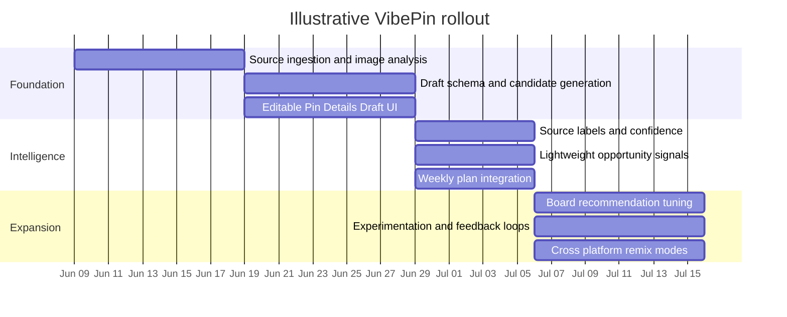

# VibePin Research and Product Design Report

## Executive summary

The strongest benchmark for VibePin is **not** a generic “AI caption generator.” It is a **Pinterest-native draft engine** that bundles visual interpretation, keywording, title and description generation, alt text, and lightweight scheduling intelligence into one fast step. Among the products reviewed, **Tailwind** is the clearest direct precedent: it says Tailwind Create generates many Pin designs at once, SmartPin can draft unique Pins each week from products or URLs, and Ghostwriter drafts Pin titles, descriptions, images, and alt text. **Pin Generator** is the closest e-commerce-adjacent alternative, with product imports from Etsy and Shopify plus keyword research and trend alerts. **Buffer** and **Hootsuite** are less Pinterest-specific, but they show a strong market norm toward editable, platform-specific AI drafting and trend-informed suggestions rather than one-shot black-box generation. citeturn19view0turn20view0turn25view0turn26view1turn26view2turn26view3turn7view2turn18view0

The platform evidence points in the same direction. Pinterest’s business site positions the platform as a place where users discover new products and brands and are ready to take action. Pinterest’s own search-relevance research says ranking quality benefits from **pin titles, pin descriptions, user-curated boards, link-based text, historically engaged queries, and captions extracted from a generative visual language model**. A separate Pinterest paper on multimodal retrieval reports measurable gains for fresh-content distribution, including a **15% Repin increase for organic content** and **8.7% higher click for new Ads** in online testing. In plain English: VibePin should treat visual meaning, landing-page meaning, and searchable text as a single bundle, and it should explicitly optimize cold-start quality for new pins. citeturn33view0turn31academia5turn39academia0

My bottom-line recommendation is to make VibePin feel like **Tailwind Create plus Buffer-style editability plus a lightweight Hootsuite-style intelligence layer**, not like a full social calendar first. The right user action is usually **“Generate Pin”**, but the system should quietly precompute a hidden `pin_image_summary`, OCR, entities, keyword candidates, and evidence links as soon as the source image or URL is available. Then, when the user clicks **Generate Pin**, VibePin should return a complete, editable draft with **three title candidates, two description candidates, one alt-text baseline, board suggestions, overlay-text options, “why this suggestion” evidence, and confidence labels**. That structure gives the user control without pushing them into manual busywork. This is an inference from the reviewed products and platform evidence, but it is a strong one. citeturn19view0turn20view0turn7view2turn18view0turn31academia5turn43view1turn43view3

## Scope and evidence base

This report assumes the requested scope is a **lightweight AI-assisted VibePin workflow** that starts from an image or URL, generates editable Pin details, supports weekly planning, and shows provenance, confidence, and opportunity intelligence in a way that helps the user decide whether to publish or add the item to a plan. That scope comes from the provided brief. fileciteturn0file0

The evidence base for the recommendations below combines direct-product pages from Tailwind, Buffer, Hootsuite, Later, Pin Generator, Adobe Express, Jasper, Copy.ai, Writesonic, Pinterest Business, and OpenAI; official YouTube Help pages; and recent peer-reviewed or preprint research from Pinterest and Xiaohongshu studies that are directly relevant to search, recommendations, multimodal understanding, and creator behavior. Where public product pages were incomplete or blocked, I stayed conservative and avoided claiming more than I could verify from accessible sources. citeturn19view0turn7view2turn18view0turn15view0turn17view0turn25view0turn47view0turn44view0turn44view1turn44view2turn33view0turn42view0turn42view1turn59view0turn60view0turn31academia5turn39academia0turn56academia0turn56academia2

## Competitive workflow comparison

| Product | What the user starts with | What the AI or automation does | What matters for VibePin | Evidence |
|---|---|---|---|---|
| Tailwind | Products, URLs, synced site content, existing photos | Generates multiple Pin designs, drafts unique weekly Pins, writes titles/descriptions/images/alt text, supports scheduling and pin spacing | This is the clearest direct benchmark for a one-click Pinterest draft bundle | citeturn19view0turn20view0 |
| Pin Generator | Connected Etsy/Shopify products, feeds, WordPress, CSV, Pinterest account | Generates and schedules Pins, offers keyword research and trend alerts, imports e-commerce products | Strong signal that Pinterest creation is more useful when coupled to product feeds plus keyword/trend inputs | citeturn25view0turn26view1turn26view2turn26view3 |
| Buffer | Prompt, existing draft, or post idea in composer | Brainstorms, rewrites, shortens, expands, adjusts tone, and crafts platform-specific posts; AI is optional, not automatic | Best model for low-friction editability and “AI as sidekick” rather than forced automation | citeturn7view2 |
| Hootsuite | Unified social workflow plus trend and listening data | Generates brand-approved captions, video scripts, creative briefs, and messages; can draft posts from trend tracking | Best model for explaining **why now** and attaching intelligence to creation, but too heavyweight as the primary VibePin feel | citeturn18view0 |
| Later | Scheduler-centric social workflow | Public pages emphasize schedule/publish, analytics, link-in-bio, content creation tools, and EdgeAI for creator intelligence | Good reminder not to bury creation inside a calendar; public pages reviewed here did not surface a strong Pinterest-detail AI flow | citeturn15view0turn17view0 |
| Adobe Express | Design canvas and social templates | Offers content scheduler, AI Assistant to prompt/create/edit, AI template/image generation, and video captioning | Strong precedent for multimodal creation inside a simple design tool, especially if VibePin expands beyond text-only drafts | citeturn47view0 |
| Jasper | Brand context, workflows, campaign inputs | Maintains brand voice, runs content pipelines, supports image pipelines, and positions itself for SEO/AEO/GEO workflows | Important lesson for VibePin defensibility: structure and context beat generic generation | citeturn45view0turn45view1 |
| Copy.ai | GTM workflows and intelligence layer | Uses workflows plus a defined brand voice and content-creation use case | Reinforces the need for reusable workflows and a separate brand/context layer | citeturn45view2turn45view3 |
| Writesonic | Search-visibility and action-center workflow | Tracks AI visibility, prioritizes actions, rewrites content for citation/GEO, and includes shopping tracking | Useful model for opportunity intelligence and “fix what matters this week,” though it is much broader than VibePin | citeturn46view2turn46view3turn46view4 |

Two conclusions follow from this comparison. First, the **highest-confidence direct pattern** is to generate a **completed Pinterest draft package**, not a single title string. Tailwind and Pin Generator both move in that direction, while Buffer shows why the output still has to feel editable and lightweight. citeturn19view0turn20view0turn25view0turn7view2

Second, the next wave of differentiation is not “more generative text.” It is **structured intelligence**: brand voice, multimodal understanding, trend context, link/context grounding, and prioritized opportunities. That is the shared lesson from Hootsuite, Jasper, Copy.ai, and Writesonic, even though those products operate at a broader scope than VibePin. citeturn18view0turn45view0turn45view2turn46view2

## Platform implications for VibePin

Pinterest should be treated as a **search-and-discovery surface with action intent**, not a caption-first vanity feed. Pinterest Business says users come to discover new products and brands and are more likely to find ads relevant because they are already there to take action. Pinterest’s own search-relevance paper adds that useful textual signals include captions from a visual language model, link-based text, board text, pin titles, pin descriptions, and historically engaged query signals. That means VibePin should never generate a title or description from the image alone unless the user explicitly asks for that fallback mode. The landing page, the product metadata, and the image all matter. citeturn33view0turn31academia5

Pinterest’s multimodal retrieval work matters for product design too. The PinCLIP paper reports that stronger image-text representations materially help fresh-content distribution, including higher Repins for new organic content and higher clicks for new Ads. That is exactly the cold-start problem VibePin faces for newly generated Pins. So, a hidden `pin_image_summary` is not optional plumbing; it is a core ranking-alignment feature. VibePin should infer image summary, OCR text, salient objects, style cues, and product/topic entities behind the scenes before it drafts user-facing text. citeturn39academia0turn43view1turn43view3

YouTube’s official creator guidance is useful as a contrast. YouTube recommends accurate and succinct titles, front-loading important words, and putting core information in the first visible lines of the description; it also explicitly frames descriptions as keyword-bearing search help and gives the description field a 5,000-character maximum. VibePin should borrow the **clarity and front-loading rule**, but not the long-description habit. For Pinterest, the better transfer is: lead with the searchable concept, avoid fluff in the opening phrase, and make the first phrase meaningful even when truncated. citeturn59view0turn60view0

For “should this feel more like Instagram, TikTok, or Xiaohongshu,” the answer is mixed. Buffer and Hootsuite both emphasize platform-specific rewriting because different channels reward different tones and structures. TikTok’s public Creator Academy page confirms a creator-growth framing, but the more useful evidence here comes from Xiaohongshu research: the platform is heavily recommendation-driven, and users intentionally manipulate feedback and even repurpose hashtags to influence audience reach and control. That suggests a caution for VibePin: **borrow the energy and variety of short-form social tools, but do not over-index on vibe-only hooks or hashtag-heavy style.** Pinterest optimization should remain centered on image meaning, query relevance, board placement, and click/save intent. Xiaohongshu-like audience signaling is best treated as an experimental style layer, not the default Pinterest strategy. citeturn7view2turn18view0turn61view0turn56academia0turn56academia2

## Recommended product design

The best VibePin workflow is a **two-stage system**: silent analysis first, explicit generation second. As soon as the user selects an image or URL, VibePin should silently compute image summary, OCR, entities, likely audience, possible keywords, and source evidence. The UI should remain calm. When the user clicks **Generate Pin**, the system should return a complete editable draft package. This mirrors OpenAI’s image-analysis pattern, aligns with Pinterest’s multimodal search signals, and avoids the “mystery auto-fill” feeling that often makes users distrust AI-generated copy. citeturn43view1turn43view3turn31academia5

| Decision | Recommendation | Why |
|---|---|---|
| When to generate | Precompute analysis silently, but generate the visible draft only on **Generate Pin** | Preserves speed and control; avoids surprising users while still keeping one-click output fast. Supported by Buffer’s optional-AI model and OpenAI’s image-analysis capabilities. citeturn7view2turn43view1turn43view3 |
| What a “generated pin” contains | **3 title candidates, 2 description candidates, 1 alt-text baseline, 3 board suggestions, 2 overlay-text options, keyword chips, and a short “why this works” note** | Tailwind already bundles multiple design and copy elements; Pinterest relevance uses multiple textual and visual signals, so one field is too thin. citeturn19view0turn20view0turn31academia5 |
| Whether to infer `pin_image_summary` | **Yes, always behind the scenes** | Pinterest search already benefits from visual captions, and stronger multimodal representations help fresh-content discovery. citeturn31academia5turn39academia0 |
| Whether to show source labels and confidence | **Yes** | Provenance is the clearest way to make AI output debuggable. Hootsuite and Writesonic both foreground intelligence/action context, which supports this direction. citeturn18view0turn46view2 |
| Whether to include opportunity intelligence | **Yes, but lightweight now** | The draft should say things like “Seasonal trend,” “Keyword gap,” or “High-fit board topic.” Hootsuite and Writesonic show the value of attaching trending or prioritized-action context to content decisions. citeturn18view0turn46view2 |
| How it should feel in the UI | **Creation-first, not calendar-first** | Later is a useful warning: when creation is hidden inside scheduling, discovery and iteration slow down. Tailwind’s create-first posture is the better reference. citeturn17view0turn19view0 |
| What style to target | **Pinterest-first with optional tone modes** such as “Searchable,” “Save-worthy,” “Click-worthy,” and later “Platform remix” | Cross-platform tools already tailor by channel, but Pinterest’s own search stack rewards structured relevance more than generic vibe writing. citeturn7view2turn18view0turn31academia5 |

The most important UX principle is that every generated field should be **editable in place** and **explainable in one click**. Users should see small chips such as **Image**, **Page**, **Keyword**, **Trend**, or **Brand** next to suggestions. When clicked, those chips should reveal a short rationale like “Derived from image OCR,” “Grounded in product title,” or “Suggested because similar search terms map to this topic.” This is an inference, but it is directly supported by the market’s move toward optional AI, brand-governed creation, and prioritized action layers. citeturn7view2turn45view0turn46view2

## Copy schema and generation logic

A good VibePin interface should sound less like a chatbot and more like a competent creative assistant. The copy should promise **drafting**, not omniscience.

| UI element | Recommended copy |
|---|---|
| Primary button | **Generate Pin** |
| Secondary action | **Add to Weekly Plan** |
| Section label | **Pin Details Draft** |
| Evidence label | **Why this suggestion** |
| Confidence chip | **High confidence** / **Medium confidence** / **Needs review** |
| Provenance chip examples | **From image** / **From page** / **From keyword signal** / **From trend signal** |
| Regeneration action | **More title options** / **Rewrite for search** / **Rewrite for clicks** / **Rewrite for saves** |
| Empty-state reassurance | **We used your image, page content, and Pinterest-oriented keyword signals to build this draft.** |

The data model should be structured enough to support explainability, ranking, and reuse, but still simple enough to ship in an MVP. A practical version looks like this:

```json
{
  "source": {
    "url": "string|null",
    "image_id": "string",
    "page_title": "string|null",
    "page_excerpt": "string|null"
  },
  "analysis": {
    "pin_image_summary": "string",
    "ocr_text": ["string"],
    "entities": ["string"],
    "topic": "string",
    "audience": ["string"],
    "intent": ["discover", "save", "shop", "learn"],
    "seasonality": ["evergreen", "seasonal", "event-driven"],
    "keywords": [
      {"term": "string", "source": "image|page|trend|manual", "confidence": 0.0}
    ],
    "signals": [
      {"type": "image|page|keyword|trend|brand", "label": "string", "evidence": "string"}
    ]
  },
  "draft": {
    "titles": [
      {"text": "string", "style": "searchable|save-worthy|click-worthy", "confidence": 0.0}
    ],
    "descriptions": [
      {"text": "string", "style": "searchable|save-worthy", "confidence": 0.0}
    ],
    "alt_text": {"text": "string", "confidence": 0.0},
    "board_suggestions": [
      {"name": "string", "reason": "string", "confidence": 0.0}
    ],
    "overlay_text_options": [
      {"text": "string", "confidence": 0.0}
    ]
  },
  "workflow": {
    "status": "draft|reviewed|scheduled|published",
    "weekly_plan_candidate": true,
    "notes": "string|null"
  }
}
```

That schema is justified by the evidence. Pinterest’s search stack uses multiple text sources tied to the image and destination, not just one caption field. Tailwind explicitly spans titles, descriptions, images, and alt text. OpenAI’s official image tooling supports both image analysis and image generation/editing, which makes it practical to separate **analysis** from **draft** and later add image-edit suggestions or overlay generation. citeturn31academia5turn19view0turn20view0turn43view3turn43view4

A strong generation algorithm for VibePin should follow this order:

| Step | What happens | Why it matters |
|---|---|---|
| Source intake | Pull the page title, excerpt, product metadata, and image | Pinterest relevance is link-aware, not image-only. citeturn31academia5 |
| Visual analysis | Produce `pin_image_summary`, OCR, objects, style, and likely topic | Multimodal understanding is core to cold-start relevance. citeturn39academia0turn43view3 |
| Keyword assembly | Merge page terms, image terms, and candidate search phrases | This mirrors Pinterest’s multi-signal search approach. citeturn31academia5 |
| Intent classification | Decide whether the pin is more “shop,” “learn,” or “save” oriented | Pinterest is action-oriented, so draft tone should match likely use case. citeturn33view0 |
| Candidate generation | Create several titles and descriptions in distinct styles | Multiple options reduce hallucinated certainty and improve perceived control. Tailwind and Buffer both support variety. citeturn19view0turn7view2 |
| Constraint pass | Remove fluff, front-load important words, dedupe near-identical options, check OCR leakage | Borrow the “accurate, succinct, most important words first” discipline from YouTube. citeturn59view0turn60view0 |
| Explainability pass | Attach source labels, rationale, and confidence to each field | Intelligence without provenance becomes hard to trust or edit. citeturn18view0turn46view2 |
| Workflow routing | Let the user publish, save draft, or add to weekly plan | Matches the requested lightweight planning behavior. fileciteturn0file0 |

## Roadmap estimates and open questions

A sensible rollout is to ship in three waves: **draft quality first, decision support second, autonomy third**. The first release should focus on getting the draft bundle right. The second should add lightweight opportunity intelligence and better provenance. The third can add experimentation, board-fit learning, and stronger weekly planning or cross-platform remixing.



Resource estimates, assuming no major legacy-platform constraints:

| Scope | Team shape | Estimated hours | Budget range |
|---|---|---:|---:|
| Prototype | 1 product designer, 1 full-stack engineer, 1 AI engineer shared, part-time PM | 240–420 | \$35,000–\$80,000 |
| MVP | 1 PM, 1 designer, 2 engineers, 1 AI engineer, part-time QA/data | 700–1,200 | \$110,000–\$250,000 |
| Intelligence upgrade | Add 1 data/ML engineer plus content ops support | 350–700 | \$60,000–\$140,000 |

What to build **now**:
- Hidden source analysis with `pin_image_summary`, OCR, and keyword assembly.
- Generate Pin returning a complete editable draft package.
- Provenance chips and confidence labels.
- One-click **Add to Weekly Plan**.
- A minimal opportunity layer with a few interpretable reasons such as **Seasonal**, **Keyword fit**, or **Board fit**.

What to build **later**:
- Trend forecasting, competitor-gap detection, or “best week to publish” reasoning.
- Learning from accepted vs rejected title styles.
- Cross-platform remixes for Instagram/TikTok variants.
- More autonomous weekly plan suggestions and batch generation.
- Visual overlay or image-edit suggestions powered by image generation or editing tools. citeturn18view0turn46view2turn43view4

Open questions and limitations:
- I was able to verify strong public evidence for Tailwind, Pin Generator, Buffer, Hootsuite, Later, Adobe Express, Jasper, Copy.ai, Writesonic, Pinterest Business, OpenAI, and YouTube. I was **not** able to verify equally strong current public evidence for every detail of **Planoly**, **native Pinterest create-flow field limits**, or **current Instagram-specific official caption guidance** in this pass, so I have not made strong claims about them.
- Publicly accessible Later pages reviewed here emphasize scheduling, analytics, link-in-bio, and creator intelligence more than explicit Pinterest-detail AI generation, so any stronger claim about Later’s current copy-generation workflow would need a dedicated verification pass.
- Xiaohongshu evidence here is research-based and recommendation-behavior-based, not an official creator guideline set, so it is best used as directional inspiration rather than as a literal template for Pinterest UX. citeturn15view0turn17view0turn56academia0turn56academia2